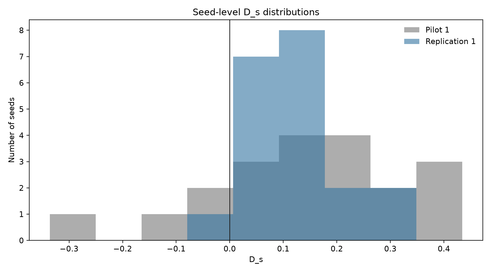
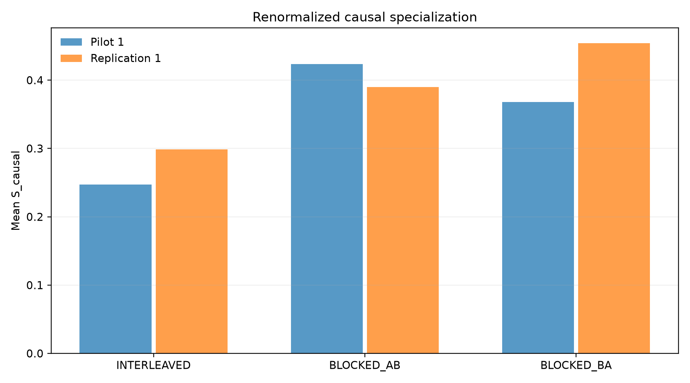
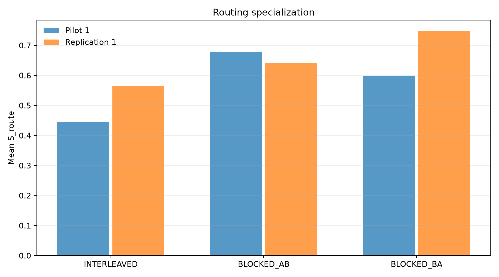
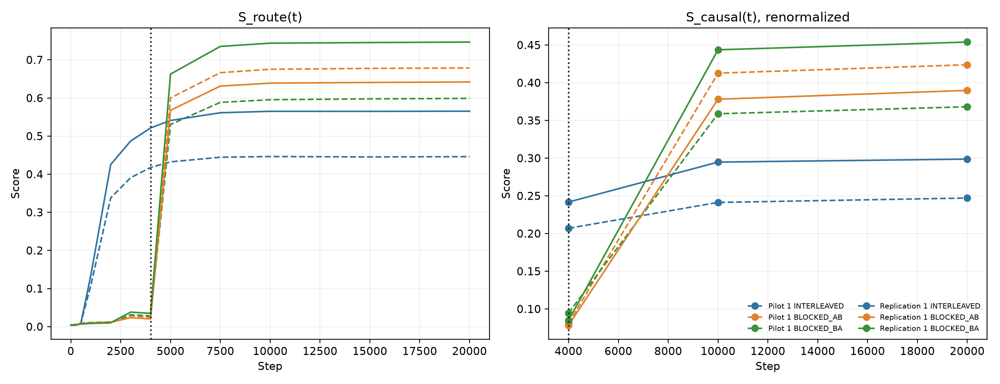

# Pilot vs Replication Quantitative Comparison

This report compares the completed Pilot 1 and Replication 1 artifacts without new training, pooling, tuning, or modification of existing result files. All inferential statistics are computed separately with `n=20` paired seeds per experiment.

## Experimental configuration comparison

| Field | Pilot 1 | Replication 1 | Status |
|---|---|---|---|
| D_s_definition | mean(S_causal_BLOCKED_AB_s, S_causal_BLOCKED_BA_s) - S_causal_INTERLEAVED_s | mean(S_causal_BLOCKED_AB_s, S_causal_BLOCKED_BA_s) - S_causal_INTERLEAVED_s | MATCH |
| S_causal_definition | 0.5 * sum_e abs(Delta_e,A - Delta_e,B) | 0.5 * sum_e abs(Delta_e,A - Delta_e,B) | MATCH |
| S_route_definition | 0.5 * sum_e abs(q_A,e - q_B,e) | 0.5 * sum_e abs(q_A,e - q_B,e) | MATCH |
| Task A | 1[x0*x1 + x2*x3 > 0] | 1[x0*x1 + x2*x3 > 0] | MATCH |
| Task B | 1[x8*x9 - x10*x11 > 0] | 1[x8*x9 - x10*x11 > 0] | MATCH |
| architecture | 18→128→128 shared encoder; Linear(128,2) softmax router; two Linear(128,256)→128 experts; residual LayerNorm; Linear(128,1) | 18→128→128 shared encoder; Linear(128,2) softmax router; two Linear(128,256)→128 experts; residual LayerNorm; Linear(128,1) | MATCH |
| batch_size | 256 | 256 | MATCH |
| common_phase_steps | 16000 | 16000 | MATCH |
| curricula | INTERLEAVED, BLOCKED_AB, BLOCKED_BA with identical 16,000-step common phase | INTERLEAVED, BLOCKED_AB, BLOCKED_BA with identical 16,000-step common phase | MATCH |
| deterministic_algorithms | not enabled in original Pilot | enabled with strict unsupported-operation failure | DIFFERENCE |
| early_phase_steps | 4000 | 4000 | MATCH |
| evaluation_examples_per_task | 50000 | 50000 | MATCH |
| expert_architecture | two identical Linear(128,256)→GELU→Linear(256,128) | two identical Linear(128,256)→GELU→Linear(256,128) | MATCH |
| input_dimensions | 16 Gaussian features + 2D one-hot task indicator = 18 | 16 Gaussian features + 2D one-hot task indicator = 18 | MATCH |
| knockout_variants | renormalized primary only | renormalized primary and non-renormalized secondary | DIFFERENCE |
| lambda_balance | 0.01 | 0.01 | MATCH |
| learning_rate | 0.0003 | 0.0003 | MATCH |
| lr_schedule | 500-step linear warmup then cosine decay | 500-step linear warmup then cosine decay | MATCH |
| metadata_hashes | config/source hashes unavailable in original result metadata | config hash and source hash recorded per run | DIFFERENCE |
| optimizer | AdamW | AdamW | MATCH |
| parameter_count | 151427 | 151427 | MATCH |
| primary_knockout | renormalized: survivor weight 1 | renormalized: survivor weight 1 | MATCH |
| requested_device | auto | auto | MATCH |
| router_architecture | Linear(128,2), Softmax(dim=-1) | Linear(128,2), Softmax(dim=-1) | MATCH |
| router_entropy_definition | entropy of task-mean routing vectors in original result JSON | true mean per-example entropy | DIFFERENCE |
| test_data_seed | 9001729 | 314159 | DIFFERENCE |
| training_data_seed | 1729 | 271828 | DIFFERENCE |
| training_steps | 20000 | 20000 | MATCH |
| weight_decay | 0.0001 | 0.0001 | MATCH |

Configuration differences are reported explicitly. The training architecture, parameter count, tasks, optimizer, schedule, curriculum definitions, primary metric, and primary knockout definition match. The data seeds, diagnostic instrumentation, and availability of the secondary knockout differ as documented above.

## Data integrity

| Experiment | Check | Value | Status |
|---|---|---|---|
| Pilot 1 | expected_run_files | True | PASS |
| Pilot 1 | complete_seed_triplets | True | PASS |
| Pilot 1 | no_duplicate_seed_condition_runs | True | PASS |
| Pilot 1 | no_missing_seeds | True | PASS |
| Pilot 1 | initial_checksum_matching | True | PASS |
| Pilot 1 | no_nan_or_inf_metrics | True | PASS |
| Pilot 1 | exposure_matching | True | PASS |
| Pilot 1 | common_mature_schedule_matching | True | PASS |
| Pilot 1 | checkpoint_completeness | True | PASS |
| Pilot 1 | configuration_hash_consistent | False | WARN |
| Pilot 1 | source_hash_consistent | False | WARN |
| Pilot 1 | source_commit_available | False | WARN |
| Replication 1 | expected_run_files | True | PASS |
| Replication 1 | complete_seed_triplets | True | PASS |
| Replication 1 | no_duplicate_seed_condition_runs | True | PASS |
| Replication 1 | no_missing_seeds | True | PASS |
| Replication 1 | initial_checksum_matching | True | PASS |
| Replication 1 | no_nan_or_inf_metrics | True | PASS |
| Replication 1 | exposure_matching | True | PASS |
| Replication 1 | common_mature_schedule_matching | True | PASS |
| Replication 1 | checkpoint_completeness | True | PASS |
| Replication 1 | configuration_hash_consistent | True | PASS |
| Replication 1 | source_hash_consistent | True | PASS |
| Replication 1 | source_commit_available | True | PASS |

## Behavioral results

| Experiment | Condition | Task A mean | Task B mean | Balanced mean | Minimum balanced |
|---|---|---|---|---|---|
| Pilot 1 | INTERLEAVED | 0.988078 | 0.987930 | 0.988004 | 0.986840 |
| Pilot 1 | BLOCKED_AB | 0.989119 | 0.988111 | 0.988615 | 0.987490 |
| Pilot 1 | BLOCKED_BA | 0.988097 | 0.988689 | 0.988393 | 0.987160 |
| Replication 1 | INTERLEAVED | 0.988118 | 0.988065 | 0.988092 | 0.987060 |
| Replication 1 | BLOCKED_AB | 0.989139 | 0.988425 | 0.988782 | 0.987830 |
| Replication 1 | BLOCKED_BA | 0.988667 | 0.989362 | 0.989014 | 0.988420 |

The blocked-minus-interleaved mean accuracy differences are reported per experiment in `comparison.json`; no accuracy values were normalized across experiments.

## Primary D_s results

| Experiment | n | Mean | Median | SD | 95% bootstrap CI | t p | Wilcoxon p | dz | +/- seeds | Min/Max |
|---|---|---|---|---|---|---|---|---|---|---|
| Pilot 1 | 20 | 0.148851 | 0.152200 | 0.193027 | [0.065438, 0.228715] | 0.002691 | 0.003153 | 0.7711 | 16/4 | [-0.335910, 0.434170] |
| Replication 1 | 20 | 0.123148 | 0.113240 | 0.087414 | [0.087182, 0.162149] | 4.774e-06 | 1.907e-06 | 1.4088 | 20/0 | [0.005960, 0.293940] |

The Pilot and Replication samples are separate. Negative seed-level values remain in the machine-readable comparison and figures.

## Seed-level distributions

The seed-level comparison aligns seeds by within-experiment ordinal position: Pilot seeds 0–19 and Replication seeds 100–119 are not treated as the same initialization seeds. The full values, quartiles, positive/negative counts, and extremes are in `seed_level_comparison.csv` and `comparison.json`.

## Causal specialization

| Experiment | Condition | S_causal mean | S_causal SD | Max |knockout Δ| mean | Max |knockout Δ| SD |
|---|---|---|---|---|---|
| Pilot 1 | INTERLEAVED | 0.247107 | 0.142993 | 0.460420 | 0.065931 |
| Pilot 1 | BLOCKED_AB | 0.423815 | 0.097383 | 0.498459 | 0.014962 |
| Pilot 1 | BLOCKED_BA | 0.368102 | 0.158769 | 0.490907 | 0.024509 |
| Replication 1 | INTERLEAVED | 0.298717 | 0.088318 | 0.483138 | 0.021449 |
| Replication 1 | BLOCKED_AB | 0.389812 | 0.131813 | 0.494585 | 0.019576 |
| Replication 1 | BLOCKED_BA | 0.453918 | 0.066611 | 0.503685 | 0.013358 |

The table above uses the renormalized knockout. Replication non-renormalized results are retained separately in `comparison.json`, `comparison.csv`, and `seed_level_comparison.csv`.

## Routing specialization

| Experiment | Condition | S_route mean | S_route SD | Router entropy mean | Collapse events |
|---|---|---|---|---|---|
| Pilot 1 | INTERLEAVED | 0.445903 | 0.276325 | 0.517087 | 0/20 |
| Pilot 1 | BLOCKED_AB | 0.678559 | 0.203249 | 0.393430 | 0/20 |
| Pilot 1 | BLOCKED_BA | 0.598591 | 0.297828 | 0.415501 | 0/20 |
| Replication 1 | INTERLEAVED | 0.565349 | 0.179450 | 0.476543 | 0/20 |
| Replication 1 | BLOCKED_AB | 0.641606 | 0.247032 | 0.404413 | 0/20 |
| Replication 1 | BLOCKED_BA | 0.747020 | 0.116323 | 0.356668 | 0/20 |

Router entropy is not treated as interchangeable across implementations: Pilot original result JSON stored entropy of task-mean routing vectors, while the post-hoc/final comparison uses the checkpoint-derived true per-example entropy where available. Collapse events are reported, not excluded.

## Developmental dynamics

Both experiments have routing history checkpoints and checkpoint-derived causal measurements at steps 4,000, 10,000, and 20,000. Pilot steps 4,000 and 10,000 are labeled `POST-HOC EXPLORATORY ANALYSIS`; they are not part of Pilot 1's original confirmatory endpoint.

## Knockout analysis

The primary renormalized knockout removes the selected expert and assigns the surviving expert weight 1. The replication's secondary non-renormalized knockout zeros the removed contribution while retaining the survivor's original probability. The two procedures are kept separate in all artifacts; neither is silently substituted for the other.

## Quantitative discrepancies

| Metric | Value |
|---|---|
| mean_D_s_replication_minus_pilot | -0.02570274956524371 |
| cohens_dz_replication_minus_pilot | 0.6376513790715742 |
| bootstrap_CI_width_pilot | 0.16327653307467693 |
| bootstrap_CI_width_replication | 0.07496747051365672 |
| positive_seed_proportion_pilot | 0.8 |
| positive_seed_proportion_replication | 1.0 |
| mean_balanced_accuracy_pilot | 0.9883373315135638 |
| mean_balanced_accuracy_replication | 0.9886293336749077 |
| pilot_replication_data_seed_difference | 270099 |
| pilot_replication_test_seed_difference | -8687570 |

These are measured differences only. This comparison does not assign causes to them.

## Machine-readable artifact inventory

| Artifact | Purpose |
|---|---|
| Pilot raw results | results/pilot_v1_frozen/raw/ |
| Pilot checkpoint ablation | results/pilot_v1_posthoc/analysis.json |
| Pilot configuration | configs/default.yaml |
| Replication raw results | results/replication/raw/ |
| Replication checkpoint ablation | results/replication/checkpoint_analysis/analysis.json |
| Replication analysis | results/replication/analysis.json |
| Replication manifest | replication_manifest.md |
| Replication config | replication_config.yaml |

Factual summary: both experiments used the same recorded training specification and showed high, closely matched final task accuracy. Replication 1 had a positive primary paired `D_s` for all 20 seeds; Pilot 1 had a positive `D_s` for 16 of 20 seeds. Mean primary `D_s` was 0.148851 in Pilot 1 and 0.123148 in Replication 1. Replication 1 also reports the separately defined non-renormalized knockout results. No general-hypothesis conclusion is made here.
